# Container Networking Project

## Project Overview
This project involves building a complete containerized microservices application infrastructure using only Linux primitives (network namespaces, veth pairs, bridges, iptables) to understand the low-level workings of container networking. The infrastructure simulates a real-world e-commerce platform with multiple services.

## System Architecture
```
┌─────────────────────────────────────────────────────────────────┐
│                    E-COMMERCE PLATFORM                          │
└─────────────────────────────────────────────────────────────────┘

External Users
     │
     ↓
┌─────────────────────────────────────────────────────────────────┐
│ EDGE LAYER                                                      │
│  ┌──────────────┐      ┌──────────────┐                         │
│  │  Load        │      │   API        │                         │
│  │  Balancer    │─────▶│   Gateway    │                        │
│  │  (nginx)     │      │   (Node.js)  │                         │
│  └──────────────┘      └──────┬───────┘                         │
└────────────────────────────────┼────────────────────────────────┘
                                 │
┌────────────────────────────────┼────────────────────────────────┐
│ APPLICATION LAYER              │                                │
│                    ┌───────────┴──────────┐                     │
│                    │                      │                     │
│         ┌──────────▼─────────┐ ┌─────────▼────────┐             │
│         │   Product Service  │ │   Order Service  │             │
│         │   (Python Flask)   │ │   (Python Flask) │             │
│         └──────────┬─────────┘ └─────────┬────────┘             │
└────────────────────┼───────────────────────┼────────────────────┘
                     │                       │
┌────────────────────┼───────────────────────┼────────────────────┐
│ DATA LAYER         │                       │                    │
│         ┌──────────▼─────────┐  ┌─────────▼────────┐            │
│         │   Redis Cache      │  │   PostgreSQL     │            │
│         │   (Session Store)  │  │   (Database)     │            │
│         └────────────────────┘  └──────────────────┘            │
└─────────────────────────────────────────────────────────────────┘
```

## Prerequisites
- Linux environment (WSL2 or Linux VM)
- Root/Sudo privileges
- Python 3
- `iproute2` (for `ip` command)
- `iptables`
- `curl`

## 1: Foundation - Linux Primitives

**Goals**
- Set up isolated network namespaces
- Create virtual network interfaces
- Implement basic inter-namespace communication

## Tasks

### Task 1.1: Create Network Namespaces

Create six network namespaces representing my services:

```
# Create namespaces
sudo ip netns add nginx-lb
sudo ip netns add api-gateway
sudo ip netns add product-service
sudo ip netns add order-service
sudo ip netns add redis-cache
sudo ip netns add postgres-db
```
### **Deliverable: Screenshot showing all namespaces created**

Run: `ip netns list`


### Task 1.2: Build a Virtual Bridge Network
---

**Create a bridge to connect all services:**

```
# Create bridge
sudo ip link add br-app type bridge
sudo ip addr add 10.0.0.1/16 dev br-app
sudo ip link set br-app up
```
**Connect each namespace to the bridge using veth pairs:**

```
# Example for nginx-lb (repeat for all services)
sudo ip link add veth-nginx type veth peer name veth-nginx-br
sudo ip link set veth-nginx netns nginx-lb
sudo ip link set veth-nginx-br master br-app
sudo ip link set veth-nginx-br up
```

**Configure inside namespace:**

```
sudo ip netns exec nginx-lb ip addr add 10.0.0.10/16 dev veth-nginx
sudo ip netns exec nginx-lb ip link set veth-nginx up
sudo ip netns exec nginx-lb ip link set lo up
sudo ip netns exec nginx-lb ip route add default via 10.0.0.1

IP:
- nginx-lb: 10.0.0.10
- api-gateway: 10.0.0.20
- product-service: 10.0.0.30
- order-service: 10.0.0.40
- redis-cache: 10.0.0.50
- postgres-db: 10.0.0.60
```
### **Deliverable:**

- **Network diagram showing my setup**

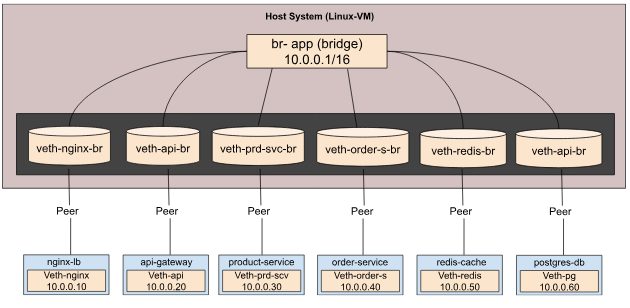

- **Showing bridge with connected interfaces**


- **Proof of connectivity (ping tests between all namespaces)**

Run : `sudo ip netns exec nginx-lb ping -c 2 10.0.0.20`

nginx-lb –-> api-gateway (10.0.0.20)

nginx-lb –-> product-service(10.0.0.30)


api-gateway –-> product-service (10.0.0.30)


### Task 1.3: Implement NAT for Internet Access
---
**Enable internet access for all namespaces:**

```
# Enable IP forwarding
sudo sysctl -w net.ipv4.ip_forward=1

# Add MASQUERADE rule
sudo iptables -t nat -A POSTROUTING -s 10.0.0.0/16 ! -o br-app -j MASQUERADE
``` 

### **Deliverable: Test internet connectivity from each namespace**

RUN: `sudo ip netns exec product-service ping -c 3 8.8.8.8`


### Task 1.4: Setup Port Forwarding 

**Forward host port 8080 to nginx-lb:**

```
# Add DNAT rule (PREROUTING - before routing decision)  
sudo iptables -t nat -A PREROUTING -p tcp --dport 8080 -j DNAT --to-destination 10.0.0.10:80

# Allow forwarding in FILTER table
sudo iptables -A FORWARD -p tcp -d 10.0.0.10 --dport 80 -j ACCEPT
```
**Now external clients can access via host IP on port 8080**

Test from host (simulating external client) to confirm request is forwarded to nginx-lb

RUN: `curl http://localhost:8080`


**View the NAT rule:**

RUN: `sudo iptables -t nat -L -v -n`


### **Deliverable: Document all iptables rules with explanations**

**Explanation of the rule:**
```
Rule:

1. sudo iptables -t nat -A POSTROUTING -s 10.0.0.0/16 ! -o br-app -j MASQUERADE

What this rule does:
  - Allows containers/namespaces to access the internet
  - Hides internal IP addresses behind the host IP
  - Required for outbound connectivity

2. sudo iptables -t nat -A PREROUTING -p tcp --dport 8080 -j DNAT --to-destination 10.0.0.10:80

What this rule does:
  - Redirects traffic from host port 8080
  - Sends it to nginx running inside the namespace on port 80
  - Enables external access to internal services

3. sudo iptables -A FORWARD -p tcp -d 10.0.0.10 --dport 80 -j ACCEPT

What this rule does:
  - Explicitly allows forwarded traffic to reach nginx-lb
  - Prevents Linux from dropping forwarded packets
  - Required for DNAT port forwarding to function
```

**Traffic Flow Summary:**

External Client (Port 8080) -> Host (Port 8080) -> DNAT -> nginx-lb (Port 80)


| Option / Flag                   | Meaning              | Explanation                                                                                    |
| ------------------------------- | -------------------- | ---------------------------------------------------------------------------------------------- |
| `-t nat`                        | NAT table            | Specifies that the rule applies to the NAT table                                               |
| `-A POSTROUTING`                | POSTROUTING chain    | Appends rule to POSTROUTING chain (applied **after** routing decision)                         |
| `-A PREROUTING`                 | PREROUTING chain     | Appends rule to PREROUTING chain (applied **before** routing decision)                         |
| `-A FORWARD`                    | FORWARD chain        | Appends rule to FORWARD chain (controls forwarded traffic)                                     |
| `-s 10.0.0.0/16`                | Source network       | Matches packets originating from the container network                                         |
| `! -o br-app`                   | Not bridge interface | Matches packets **not** leaving via the bridge interface (i.e., traffic going to the internet) |
| `-p tcp`                        | TCP protocol         | Matches TCP traffic                                                                            |
| `--dport 8080`                  | Destination port     | Matches packets destined to port **8080** on the host                                          |
| `--dport 80`                    | Destination port     | Matches packets destined to port **80**                                                        |
| `-d 10.0.0.10`                  | Destination IP       | Matches destination IP address of the nginx-lb namespace                                       |
| `-j MASQUERADE`                 | SNAT action          | Applies MASQUERADE (dynamic Source NAT), rewriting source IP to host’s external IP             |
| `-j DNAT`                       | DNAT action          | Applies Destination NAT, rewriting destination IP and/or port                                  |
| `--to-destination 10.0.0.10:80` | DNAT target          | Forwards traffic to nginx-lb namespace at IP `10.0.0.10` on port `80`                          |
| `-j ACCEPT`                     | Accept action        | Allows the packet to be forwarded                                                              |

## **2: Application Services**

**Goals**
- Deploy actual services in namespaces
- Implement service-to-service communication
- Test the complete application flow

## Tasks

### Task 2.1: Deploy Nginx Load Balancer

Create a simple nginx configuration that load balances to the API gateway:

Install and run nginx in the namespace:
```
# Create nginx config

sudo ip netns exec nginx-lb bash -c 'cat <<EOF > /tmp/nginx/nginx.conf
events {
    worker_connections 1024;
}

http {
    upstream api_gateway {
        server 10.0.0.20:3000;
    }

    server {
        listen 80;

        location / {
            proxy_pass http://api_gateway;
            proxy_set_header Host \$host;
            proxy_set_header X-Real-IP \$remote_addr;
        }

        location /health {
            return 200 "OK\n";
            add_header Content-Type text/plain;
        }
    }
}
EOF'
```
Verify the nginx config file has been created in nginx-lb namespace

RUN: `sudo ip netns exec nginx-lb cat /tmp/nginx/nginx.conf`

Start nginx inside nginx-lb namespace

RUN: `sudo ip netns exec nginx-lb nginx -c /tmp/nginx/nginx.conf`

### Deliverable: Working load balancer responding to HTTP requests

**Test from host:** 

RUN: `curl http://192.168.56.104:8080/health`  


**Test from another namespace:**

RUN: `sudo ip netns exec api-gateway curl http://10.0.0.10/health`  


### Task 2.2: Create API Gateway

**Build a Node.js or Python API gateway that routes to backend services.**

**create api-gateway.py:**
```
from flask import Flask, jsonify, request
import requests

app = Flask(__name__)

PRODUCT_SERVICE = "http://10.0.0.30:5000"
ORDER_SERVICE = "http://10.0.0.40:5000"

@app.route('/health')
def health():
    return jsonify({"status": "healthy", "service": "api-gateway"})

@app.route('/api/products', methods=['GET'])
def get_products():
    try:
        response = requests.get(f"{PRODUCT_SERVICE}/products")
        return jsonify(response.json()), response.status_code
    except Exception as e:
        return jsonify({"error": str(e)}), 503

@app.route('/api/products/<id>', methods=['GET'])
def get_product(id):
    try:
        response = requests.get(f"{PRODUCT_SERVICE}/products/{id}")
        return jsonify(response.json()), response.status_code
    except Exception as e:
        return jsonify({"error": str(e)}), 503

@app.route('/api/orders', methods=['POST'])
def create_order():
    try:
        response = requests.post(
            f"{ORDER_SERVICE}/orders",
            json=request.json
        )
        return jsonify(response.json()), response.status_code
    except Exception as e:
        return jsonify({"error": str(e)}), 503

if __name__ == '__main__':
    app.run(host='0.0.0.0', port=3000)
```
```
Copy file to accessible location

sudo ip netns exec api-gateway bash -c 'cat <<EOF > /tmp/api-gateway.py
EOF'

# Install dependencies in namespace or use a Python virtual environment
sudo ip netns exec api-gateway pip install flask requests

# Start api-gateway
sudo ip netns exec api-gateway python3 /tmp/api-gateway.py &
```
**Flask running inside the api-gateway namespace on port 3000:**

RUN: `sudo ip netns exec api-gateway ss -lntp | grep 3000`


**Testing the Api health  from inside the namespace:**

RUN: `sudo ip netns exec api-gateway curl http://127:3000/health`


**Test from other namespaces (e.g., nginx-lb)**

RUN: `sudo ip netns exec nginx-lb curl http://10.0.0.20:3000/health`


### Deliverable: API Gateway responding to requests and routing correctly

- **Test API Gateway Routing to product-service from api-gateway namespace:** 

  RUN: `sudo ip netns exec api-gateway curl http://localhost:3000/api/products`

  

- **Then test API Gateway Routing to product service via my host port-forwarding to confirm everything works end-to-end:** 

  RUN: `curl http://192.168.56.104:8080/api/products`

      

- **Test API Gateway Routing to order-service from api-gateway namespace:** 

  RUN: `sudo ip netns exec api-gateway curl http://localhost:3000/api/orders`

  

- **Then test API Gateway Routing to order service via my host port-forwarding to confirm everything works end-to-end:** 

  RUN: `curl http://192.168.56.104:8080/api/orders`

    

### Task 2.3: Build Product Service

**Create product-service.py:**
```
from flask import Flask, jsonify
import redis
import json

app = Flask(__name__)

# Connect to Redis cache
try:
    cache = redis.Redis(host='10.0.0.50', port=6379, decode_responses=True)
except:
    cache = None

# Mock product database
PRODUCTS = {
    "1": {"id": "1", "name": "Laptop", "price": 999.99, "stock": 50},
    "2": {"id": "2", "name": "Mouse", "price": 29.99, "stock": 200},
    "3": {"id": "3", "name": "Keyboard", "price": 79.99, "stock": 150},
}

@app.route('/health')
def health():
    return jsonify({"status": "healthy", "service": "product-service"})

@app.route('/products', methods=['GET'])
def get_products():
    # Try cache first
    if cache:
        cached = cache.get('all_products')
        if cached:
            return jsonify(json.loads(cached))
    
    # Return products and cache
    products = list(PRODUCTS.values())
    if cache:
        cache.setex('all_products', 300, json.dumps(products))
    
    return jsonify(products)

@app.route('/products/<product_id>', methods=['GET'])
def get_product(product_id):
    # Try cache first
    if cache:
        cached = cache.get(f'product_{product_id}')
        if cached:
            return jsonify(json.loads(cached))
    
    product = PRODUCTS.get(product_id)
    if not product:
        return jsonify({"error": "Product not found"}), 404
    
    if cache:
        cache.setex(f'product_{product_id}', 300, json.dumps(product))
    
    return jsonify(product)

if __name__ == '__main__':
    app.run(host='0.0.0.0', port=5000)
```
**Start product-service:** `sudo ip netns exec product-service python3 /tmp/product-service.py &'`   

**Verify product-service is running:**`sudo ip netns exec product-service ss -lntp | grep 5000`

### Deliverable: Working product service with Redis caching

**Redis running inside its namespace and listening on port 6379:**

RUN: `sudo ip netns exec redis-cache ss -lntp | grep 6379`


**Product-service successfully connect to redis cache:**

RUN: `sudo ip netns exec product-service nc -zv 10.0.0.50 6379`


**API Gateway Routing to product-service from api-gateway namespace:** 

RUN: `sudo ip netns exec api-gateway curl http://localhost:3000/api/products`

  

### Task 2.4: Build Order Service

**Create order-service.py:**
```
from flask import Flask, jsonify, request
import psycopg2
from datetime import datetime
import json

app = Flask(__name__)

# Database connection
def get_db():
    return psycopg2.connect(
        host='10.0.0.60',
        database='orders',
        user='postgres',
        password='postgres'
    )

# Initialize database
def init_db():
    conn = get_db()
    cur = conn.cursor()
    cur.execute('''
        CREATE TABLE IF NOT EXISTS orders (
            id SERIAL PRIMARY KEY,
            customer_id VARCHAR(100),
            product_id VARCHAR(100),
            quantity INTEGER,
            total_price DECIMAL(10, 2),
            created_at TIMESTAMP DEFAULT CURRENT_TIMESTAMP
        )
    ''')
    conn.commit()
    cur.close()
    conn.close()

@app.route('/health')
def health():
    return jsonify({"status": "healthy", "service": "order-service"})

@app.route('/orders', methods=['POST'])
def create_order():
    data = request.json
    
    conn = get_db()
    cur = conn.cursor()
    
    cur.execute(
        '''INSERT INTO orders (customer_id, product_id, quantity, total_price)
           VALUES (%s, %s, %s, %s) RETURNING id''',
        (data['customer_id'], data['product_id'], 
         data['quantity'], data['total_price'])
    )
    
    order_id = cur.fetchone()[0]
    conn.commit()
    cur.close()
    conn.close()
    
    return jsonify({"order_id": order_id, "status": "created"}), 201

@app.route('/orders/<order_id>', methods=['GET'])
def get_order(order_id):
    conn = get_db()
    cur = conn.cursor()
    
    cur.execute('SELECT * FROM orders WHERE id = %s', (order_id,))
    order = cur.fetchone()
    
    cur.close()
    conn.close()
    
    if not order:
        return jsonify({"error": "Order not found"}), 404
    
    return jsonify({
        "id": order[0],
        "customer_id": order[1],
        "product_id": order[2],
        "quantity": order[3],
        "total_price": float(order[4]),
        "created_at": order[5].isoformat()
    })

if __name__ == '__main__':
    init_db()
    app.run(host='0.0.0.0', port=5000)
```

**Start order-service:** `sudo ip netns exec order-service python3 /tmp/order-service.py &'`   

**Verify order-service is running and listening on port 5000:**`sudo ip netns exec order-service ss -lntp | grep 5000`


### Deliverable: Working order service with PostgreSQL integration

**postgres running as a container:** RUN: `sudo docker ps`


**PostgreSQL listening on port 5432:**RUN: `ss -lntp | grep 5432` 


**Order-service reaching postgres:**

RUN: `sudo ip netns exec order-service nc -zv 10.0.0.1 5432`


**To confirm order-service can reach PostgreSQL and data is stored correctly:**

- Creating an order (WRITE to PostgreSQL) to confirm order successfully created via API Gateway (PostgreSQL write)

```
sudo ip netns exec api-gateway curl -X POST http://localhost:3000/api/orders \
  -H "Content-Type: application/json" \
  -d '{
    "customer_id": "cust-101",
    "product_id": "prod-201",
    "quantity": 2,
    "total_price": 150.00
  }'
```


- Verify order record exist and persisted in PostgreSQL database

RUN: `psql -U postgres -d orders -h 10.0.0.1 -c "SELECT * FROM orders;"`


- check from within order-service namespace to confirm the order created via api gateway and stored in postgres:

RUN: `sudo ip netns exec order-service psql -U postgres -d orders -h 10.0.0.1 -c "SELECT * FROM orders;"`


### Task 2.5: Deploy Redis and PostgreSQL

**Run Redis:** `sudo ip netns exec redis-cache redis-server --bind 0.0.0.0 &`


**Run PostgreSQL:**

Create a PostgreSQL container on host:

```
docker run -d --name postgres \
  -p 5432:5432 \
  -e POSTGRES_USER=postgres \
  -e POSTGRES_PASSWORD=postgres \
  -e POSTGRES_DB=orders \
  postgres:15
```
RUN: `sudo docker ps`


### Deliverable: Both data stores operational and accessible

- Redis running inside redis-cache namespace and accessible on port 6379

  

- Product-service can reach Redis in redis-cache namespace

RUN: `sudo ip netns exec product-service nc -zv 10.0.0.50 6379`


- Order-service can reach postgresSQL

RUN: `sudo ip netns exec order-service nc -zv 10.0.0.1 5432`


## **3: Monitoring and Debugging**

**Goals**

- Implement network monitoring
- Create debugging tools
- Add observability to your infrastructure

## Tasks

### Task 3.1: Network Traffic Analysis 

**Create a script that monitors traffic on the bridge and dump it on a log file:**

```
#!/bin/bash
# monitor-traffic.sh

LOG_FILE="traffic_log_$(date '+%Y%m%d_%H%M%S').log"

echo "=== Network Traffic Monitor ==="
echo "Monitoring bridge: br-app"
echo "Logging to $LOG_FILE"
echo "Press Ctrl+C to stop"
echo ""

sudo tcpdump -i br-app -n -v -tttt > "$LOG_FILE"
``` 
**Run the traffic monitor:** 

`chmod +x monitor-traffic.sh`

`./monitor-traffic.sh`

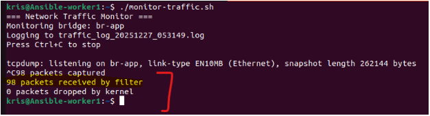

**Tcpdump running with app traffic:**

`sudo tcpdump -i br-app -n -v -tttt`


### Create a python script to analyze my log file **"traffic_log"** and create a csv file for each analysis
---

`sudo nano traffic_analysis_services.py`
```
#!/usr/bin/env python3

import glob
import re
import pandas as pd
import matplotlib.pyplot as plt

# ============================
# SERVICE ↔ IP MAP
# ============================

SERVICE_MAP = {
    "10.0.0.10": "nginx-lb",
    "10.0.0.20": "api-gateway",
    "10.0.0.30": "product-service",
    "10.0.0.40": "order-service",
    "10.0.0.50": "redis-cache",
    "10.0.0.60": "postgres-db",
}

LOG_PATTERN = "traffic_log_*.log"

# ============================
# LOAD & NORMALIZE TCPDUMP LOG
# ============================

log_files = glob.glob(LOG_PATTERN)
if not log_files:
    print("❌ No traffic_log_*.log files found")
    exit(1)

raw_lines = []
for file in log_files:
    with open(file, "r") as f:
        raw_lines.extend(f.readlines())

print(f"✅ Loaded {len(raw_lines)} tcpdump lines")

# Merge indented lines with previous line
lines = []
buffer = ""

for line in raw_lines:
    if line.startswith(" ") or line.startswith("\t"):
        buffer += " " + line.strip()
    else:
        if buffer:
            lines.append(buffer)
        buffer = line.strip()

if buffer:
    lines.append(buffer)

# ============================
# PARSE IPv4 PACKETS
# ============================

IPV4_REGEX = re.compile(
    r"(\d+\.\d+\.\d+\.\d+)\.\d+\s*>\s*(\d+\.\d+\.\d+\.\d+)\.\d+"
)

records = []

for line in lines:
    if "IP6" in line:
        continue

    match = IPV4_REGEX.search(line)
    if not match:
        continue

    src_ip, dst_ip = match.groups()

    if "ICMP" in line:
        protocol = "ICMP"
    elif "UDP" in line:
        protocol = "UDP"
    elif "Flags" in line:
        protocol = "TCP"
    else:
        protocol = "OTHER"

    records.append({
        "source": SERVICE_MAP.get(src_ip, src_ip),
        "destination": SERVICE_MAP.get(dst_ip, dst_ip),
        "protocol": protocol
    })

# ============================
# DATAFRAME
# ============================

df = pd.DataFrame(records)

if df.empty:
    print("❌ No IPv4 service traffic detected")
    exit(1)

print(f"✅ Parsed {len(df)} packets")

# ============================
# ANALYSIS
# ============================

pair_counts = df.groupby(["source", "destination"]).size().reset_index(name="packets")
pair_counts.to_csv("packets_per_service_pair.csv", index=False)

protocol_counts = df["protocol"].value_counts().reset_index()
protocol_counts.columns = ["protocol", "packets"]
protocol_counts.to_csv("protocol_distribution.csv", index=False)

top_talkers = df["source"].value_counts().reset_index()
top_talkers.columns = ["service", "packets"]
top_talkers.to_csv("top_talkers.csv", index=False)

# ============================
# GRAPHS
# ============================

plt.figure()
plt.bar(protocol_counts["protocol"], protocol_counts["packets"])
plt.title("Protocol Distribution")
plt.tight_layout()
plt.savefig("protocol_distribution.png")
plt.close()

top_pairs = pair_counts.sort_values("packets", ascending=False).head(10)
plt.figure(figsize=(10, 5))
plt.barh(
    top_pairs["source"] + " → " + top_pairs["destination"],
    top_pairs["packets"]
)
plt.title("Top Service-to-Service Traffic")
plt.tight_layout()
plt.savefig("top_service_pairs.png")
plt.close()

plt.figure()
plt.bar(top_talkers["service"], top_talkers["packets"])
plt.title("Top Talkers")
plt.tight_layout()
plt.savefig("top_talkers.png")
plt.close()

print("\n🎉 Traffic analysis complete!")
```

**Run python file: `python3 traffic_analysis_services.py` to analyze the tcdump log file and create csv file for each analysis**


**CSV files created by python script:**


**Assignment: Create a traffic analysis report showing:**

- Packets between each service pair

  

- Protocol distribution (TCP/UDP/ICMP)

  

- Top talkers (most active services)

  

### Deliverable: Traffic analysis report with graphs:
---
Create a python script `sudo nano generate_traffic_report.py file` that will generate a traffic analysis report for each csv file created by the python script **traffic_analysis_services.py**.

```
#!/usr/bin/env python3

from reportlab.platypus import (
    SimpleDocTemplate, Paragraph, Spacer, Image, Table, TableStyle
)
from reportlab.lib.styles import getSampleStyleSheet
from reportlab.lib.pagesizes import A4
from reportlab.lib import colors
import pandas as pd
import os
from datetime import datetime

# ============================
# FILES
# ============================

REPORT_NAME = "traffic_analysis_report.pdf"

CSV_FILES = {
    "Service Traffic": "packets_per_service_pair.csv",
    "Protocol Distribution": "protocol_distribution.csv",
    "Top Talkers": "top_talkers.csv",
}

IMAGES = [
    "protocol_distribution.png",
    "top_service_pairs.png",
    "top_talkers.png",
]

# ============================
# DOCUMENT SETUP
# ============================

doc = SimpleDocTemplate(REPORT_NAME, pagesize=A4)
styles = getSampleStyleSheet()
elements = []

# ============================
# TITLE
# ============================

elements.append(Paragraph(
    "<b>Network Traffic Analysis Report</b>",
    styles["Title"]
))
elements.append(Spacer(1, 12))

elements.append(Paragraph(
    f"Generated on: {datetime.now().strftime('%Y-%m-%d %H:%M:%S')}",
    styles["Normal"]
))
elements.append(Spacer(1, 20))

# ============================
# EXECUTIVE SUMMARY
# ============================

summary_text = """
This report presents an analysis of network traffic captured on the <b>br-app</b>
Linux bridge connecting multiple microservices implemented using network namespaces.
The goal is to validate service-to-service communication, protocol usage, and identify
top traffic sources within the application architecture.
"""

elements.append(Paragraph("<b>Executive Summary</b>", styles["Heading2"]))
elements.append(Spacer(1, 8))
elements.append(Paragraph(summary_text, styles["Normal"]))
elements.append(Spacer(1, 20))

# ============================
# TABLE SECTIONS
# ============================

for title, csv_file in CSV_FILES.items():
    if not os.path.exists(csv_file):
        continue

    df = pd.read_csv(csv_file)

    elements.append(Paragraph(f"<b>{title}</b>", styles["Heading2"]))
    elements.append(Spacer(1, 10))

    table_data = [df.columns.tolist()] + df.values.tolist()

    table = Table(table_data, repeatRows=1)
    table.setStyle(TableStyle([
        ("BACKGROUND", (0, 0), (-1, 0), colors.lightgrey),
        ("GRID", (0, 0), (-1, -1), 0.5, colors.grey),
        ("ALIGN", (0, 0), (-1, -1), "CENTER"),
        ("FONT", (0, 0), (-1, 0), "Helvetica-Bold"),
    ]))

    elements.append(table)
    elements.append(Spacer(1, 20))

# ============================
# GRAPHS
# ============================

elements.append(Paragraph("<b>Traffic Visualization</b>", styles["Heading2"]))
elements.append(Spacer(1, 12))

for img in IMAGES:
    if os.path.exists(img):
        elements.append(Image(img, width=400, height=250))
        elements.append(Spacer(1, 15))

# ============================
# BUILD REPORT
# ============================

doc.build(elements)

print("✅ PDF report generated successfully:")
print(f"   {REPORT_NAME}")
```
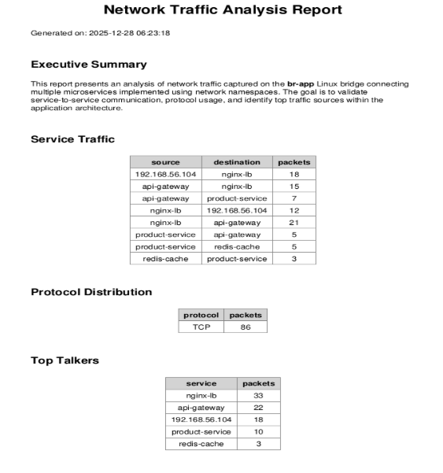


### Task 3.2: Service Health Monitoring

Create health-monitor.py:

```
#!/usr/bin/env python3
import requests
import time
from datetime import datetime
import json

SERVICES = {
    'nginx-lb': 'http://10.0.0.10/health',
    'api-gateway': 'http://10.0.0.20:3000/health',
    'product-service': 'http://10.0.0.30:5000/health',
    'order-service': 'http://10.0.0.40:5000/health',
}

def check_health(service_name, url):
    try:
        response = requests.get(url, timeout=2)
        if response.status_code == 200:
            return {"status": "UP", "latency": response.elapsed.total_seconds()}
        else:
            return {"status": "DOWN", "error": f"HTTP {response.status_code}"}
    except Exception as e:
        return {"status": "DOWN", "error": str(e)}

def monitor():
    print("=== Service Health Monitor ===")
    print(f"Started at: {datetime.now()}")
    print("")

    while True:
        print(f"\n[{datetime.now().strftime('%H:%M:%S')}] Health Check:")
        print("-" * 60)

        for service, url in SERVICES.items():
            health = check_health(service, url)
            status_symbol = "✓" if health['status'] == 'UP' else "✗"

            if health['status'] == 'UP':
                print(f"{status_symbol} {service:20s} UP   (latency: {health['latency']*1000:.2f}ms)")
            else:
                print(f"{status_symbol} {service:20s} DOWN ({health.get('error', 'Unknown')})")
 
        time.sleep(10)

if __name__ == '__main__':
    monitor()
```

### Deliverable: Health monitoring dashboard showing service status
---
Modify file permission and execute:

`sudo chmod +x health-monitor.py`

`sudo ./health-monitor.py`

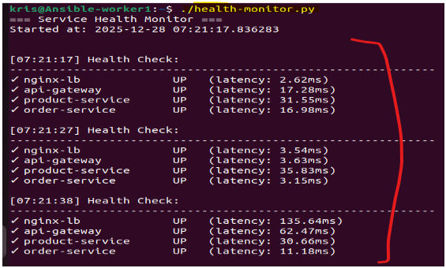

### Task 3.3: Connection Tracking Analysis

Create a script to analyze active connections: `sudo nano connection-tracker.sh`

```
#!/bin/bash
# connection-tracker.sh

echo "=== Active Connection Tracker ==="
echo "Press Ctrl+C to stop"

while true; do
    clear
    echo "=== Active Connections ($(date)) ==="
    echo ""

    echo "Connections by Service:"
    echo "----------------------"

    for ns in nginx-lb api-gateway product-service order-service; do
        if ip netns list | grep -q "$ns"; then
            count=$(sudo ip netns exec $ns ss -tan state established | wc -l)
            echo "$ns: $count active connections"
        else
            echo "$ns: namespace not found"
        fi
    done

    echo ""
    echo "Connection States (conntrack):"
    echo "-----------------------------"

    sudo conntrack -L 2>/dev/null | grep "10.0.0" | \
    awk '
    {
      for(i=1;i<=NF;i++) {
        if($i ~ /^dst=/) {
          gsub("dst=","",$i)
          print $i
        }
      }
    }' | \
    sed \
      -e 's/10.0.0.10/nginx-lb/' \
      -e 's/10.0.0.20/api-gateway/' \
      -e 's/10.0.0.30/product-service/' \
      -e 's/10.0.0.40/order-service/' \
      -e 's/10.0.0.50/redis-cache/' | \
    sort | uniq -c | sort -rn

    sleep 5
done
```
### Deliverable: Connection tracking report
---
Modify file permission and execute

`chmod +x connection-tracker.sh`

`sudo ./connection-tracker.sh`

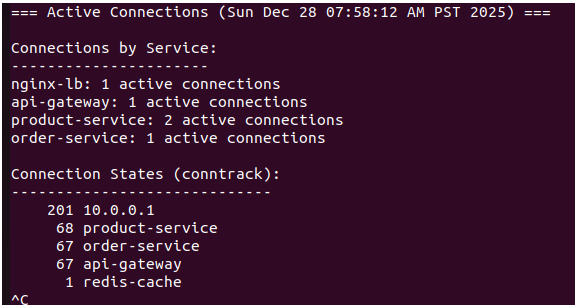


### Task 3.4: Network Topology Visualizer

Create a script that generates a visual representation of your network: `sudo nano topology-visualizer.py`

```
#!/usr/bin/env python3
# topology-visualizer.py

import subprocess
import re

NAMESPACES = [
    'nginx-lb',
    'api-gateway',
    'product-service',
    'order-service',
    'redis-cache',
    'postgres-db'
]

def get_namespace_ips():
    """Get IPv4 addresses for all namespaces"""
    ips = {}

    for ns in NAMESPACES:
        try:
            result = subprocess.run(
                ['sudo', 'ip', 'netns', 'exec', ns, 'ip', '-4', 'addr', 'show'],
                capture_output=True, text=True, check=True
            )
            match = re.search(r'inet (\d+\.\d+\.\d+\.\d+)', result.stdout)
            if match:
                ips[ns] = match.group(1)
            else:
                ips[ns] = "N/A"
        except subprocess.CalledProcessError:
            ips[ns] = "N/A"

    return ips

def draw_topology():
    ips = get_namespace_ips()

    print("=" * 80)
    print(" " * 25 + "NETWORK TOPOLOGY DIAGRAM")
    print("=" * 80)
    print()
    print("                    🌍 Internet")
    print("                         │")
    print("                         │  NAT")
    print("                         ▼")
    print("                ┌─────────────────┐")
    print("                │ Host            │")
    print("                │ Port: 8080      │")
    print("                └────────┬────────┘")
    print("                         │ DNAT")
    print("                         ▼")
    print("            ┌────────────────────────┐")
    print("            │ Bridge: br-app         │")
    print("            │ IP: 10.0.0.1           │")
    print("            └─────────┬──────────────┘")
    print("                      │")
    print("        ┌─────────────┼─────────────────┐")
    print("        │             │                 │")

    for service, ip in ips.items():
        print(f"  {service:18s} → {ip}")

    print()
    print("=" * 80)

if __name__ == "__main__":
    draw_topology()
```
### Deliverable: Network topology diagram
---
Modify file permission and execute:

`sudo chmod +x topology-visualizer.py`

`python3 topology-visualizer.py` 

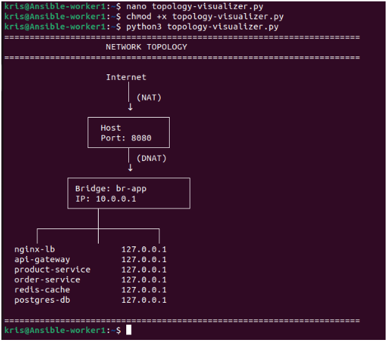


## **4: Advanced Networking**

**Goals**

- Implement service discovery
- Add load balancing
- Create network security policies

## Tasks

### Task 4.1: Implement Simple Service Discovery

Create a simple DNS-like service registry: `sudo nano service-registry.py`
```
#!/usr/bin/env python3
# service-registry.py

from flask import Flask, jsonify, request
import time

app = Flask(__name__)

# In-memory registry
services = {}

@app.route('/register', methods=['POST'])
def register_service():
    data = request.json

    service_name = data['name']
    service_ip = data['ip']
    service_port = data['port']

    services[service_name] = {
        "ip": service_ip,
        "port": service_port,
        "registered_at": time.strftime('%Y-%m-%d %H:%M:%S'),
        "health": "unknown"
    }

    return jsonify({
        "status": "registered",
        "service": service_name
    })

@app.route('/discover/<service_name>', methods=['GET'])
def discover_service(service_name):
    if service_name in services:
        return jsonify(services[service_name])
    return jsonify({"error": "Service not found"}), 404

@app.route('/services', methods=['GET'])
def list_services():
    return jsonify(services)

@app.route('/deregister/<service_name>', methods=['DELETE'])
def deregister(service_name):
    if service_name in services:
        del services[service_name]
        return jsonify({"status": "deregistered"})
    return jsonify({"error": "Service not found"}), 404

if __name__ == "__main__":
    app.run(host="10.0.0.70", port=8500)
```
**Run registry in its own namespace**

Create a new namespace and start registry: 

`sudo ip netns exec service-registry python3 service-registry.py`


**Edit my services file (product, order, api-gateway) to register themselves on startup**  

`sudo ip netns exec product-service python3 product-service.py`

`sudo ip netns exec order-service python3 order-service.py`

`sudo ip netns exec api-gateway python3 api-gateway.py`

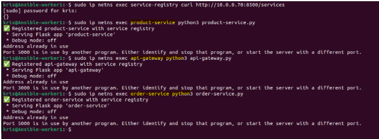

### Deliverable: Working service discovery with all services registered
---
`sudo ip netns exec service-registry python3 service-registry.py`

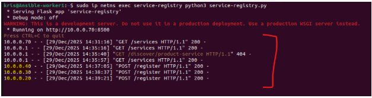

**Test Service Discovery**

Run: `curl http://10.0.0.70:8500/services`

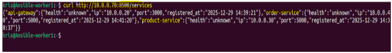

Run `curl http://10.0.0.70:8500/discover/product-service`

Run `curl http://10.0.0.70:8500/discover/order-service`

Run `curl http://10.0.0.70:8500/discover/api-gateway`

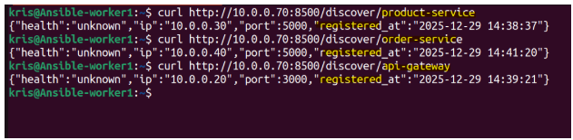

### Task 4.2: Implement Round-Robin Load Balancing 

**Modify the API Gateway to load balance between multiple instances:**
```
# Enhanced API Gateway with load balancing
import requests
import itertools

class LoadBalancer:
    def __init__(self, backends):
        self.backends = itertools.cycle(backends)
        self.backend_list = backends
    
    def get_backend(self):
        return next(self.backends)
    
    def health_check(self):
        healthy = []
        for backend in self.backend_list:
            try:
                response = requests.get(f"{backend}/health", timeout=1)
                if response.status_code == 200:
                    healthy.append(backend)
            except:
                pass
        self.backends = itertools.cycle(healthy)
        return healthy

# Use in routes
product_lb = LoadBalancer([
    "http://10.0.0.30:5000",
    "http://10.0.0.31:5000",  # Add second instance
    "http://10.0.0.32:5000",  # Add third instance
])
```
Create multiple instances of product-service

```
#!/bin/bash
# multiple_instance.sh
# Adds extra network namespaces for load balancing testing

set -e

echo "Setting up extra product service nodes..."

# Create namespaces
sudo ip netns add product2 || true
sudo ip netns add product3 || true

# Create veth pairs
sudo ip link add veth-prod2 type veth peer name veth-prod2-br || true
sudo ip link add veth-prod3 type veth peer name veth-prod3-br || true

# Attach to bridge (assuming br-app exists from previous tasks)
sudo ip link set veth-prod2-br master br-app
sudo ip link set veth-prod3-br master br-app

# Move interfaces to namespaces
sudo ip link set veth-prod2 netns product2
sudo ip link set veth-prod3 netns product3

# Bring up bridge side
sudo ip link set veth-prod2-br up
sudo ip link set veth-prod3-br up

# Configure IPs
sudo ip netns exec product2 ip addr add 10.0.0.31/16 dev veth-prod2
sudo ip netns exec product2 ip link set veth-prod2 up
sudo ip netns exec product2 ip route add default via 10.0.0.1

sudo ip netns exec product3 ip addr add 10.0.0.32/16 dev veth-prod3
sudo ip netns exec product3 ip link set veth-prod3 up
sudo ip netns exec product3 ip route add default via 10.0.0.1

# Enable loopback
sudo ip netns exec product2 ip link set lo up
sudo ip netns exec product3 ip link set lo up

echo "multiple instance of product service complete:"
echo "product2: 10.0.0.31"
echo "product3: 10.0.0.32"
```
**Register each instance separately in the service registry**
```
export SERVICE_IP="10.0.0.30"
export SERVICE_PORT=5000
export INSTANCE_ID="product-1"
python3 product-service.py

export SERVICE_IP="10.0.0.31"
export SERVICE_PORT=5000
export INSTANCE_ID="product-2"
python3 product-service.py

export SERVICE_IP="10.0.0.32"
export SERVICE_PORT=5000
export INSTANCE_ID="product-3"
python3 product-service.py
```


### Deliverable: Load balancing working with request distribution logs
---


### Task 4.3: Network Security Policies

Implement iptables rules for security:

```
#!/bin/bash
# security-policies.sh

echo "Applying network security policies..."

# Allow established connections (VERY IMPORTANT)
iptables -A FORWARD -m conntrack --ctstate ESTABLISHED,RELATED -j ACCEPT

# 1. Block direct access to database from outside order-service
iptables -A FORWARD ! -s 10.0.0.40/32 -d 10.0.0.60/32 -p tcp --dport 5432 -j DROP
echo "✓ Database isolated to order-service only"

# 2. Block direct access to Redis from outside product-service
iptables -A FORWARD ! -s 10.0.0.30/32 -d 10.0.0.50/32 -p tcp --dport 6379 -j DROP
echo "✓ Redis isolated to product-service only"

# 3. Rate limit connections to API Gateway
iptables -A FORWARD -d 10.0.0.20/32 -p tcp --dport 3000 \
  -m limit --limit 100/minute --limit-burst 20 -j ACCEPT

iptables -A FORWARD -d 10.0.0.20/32 -p tcp --dport 3000 -j DROP
echo "✓ Rate limiting applied to API Gateway"

# 4. Allow only HTTP/HTTPS/DNS outbound from services
iptables -A FORWARD -s 10.0.0.0/16 -p tcp --dport 80 -j ACCEPT
iptables -A FORWARD -s 10.0.0.0/16 -p tcp --dport 443 -j ACCEPT
iptables -A FORWARD -s 10.0.0.0/16 -p tcp --dport 53 -j ACCEPT
iptables -A FORWARD -s 10.0.0.0/16 -p udp --dport 53 -j ACCEPT
echo "✓ Outbound traffic restricted"

# 5. Log dropped packets
iptables -A FORWARD -j LOG --log-prefix "DROPPED: " --log-level 4

echo "Security policies applied successfully!"
```
`sudo nano security-policies.sh`

`sudo chmod +x security-policies.sh`

`sudo ./security-policies.sh`

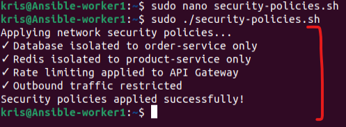

### Deliverable: Network security policies implemented

[Click to access Security Policy Document](security-policy-document.md)

### Task 4.4: Implement Network Isolation

Create separate networks for different tiers:

```
# Frontend
sudo ip link add br-frontend type bridge
sudo ip addr add 172.20.0.1/24 dev br-frontend
sudo ip link set br-frontend up

# Backend
sudo ip link add br-backend type bridge
sudo ip addr add 172.21.0.1/24 dev br-backend
sudo ip link set br-backend up

# Database
sudo ip link add br-database type bridge
sudo ip addr add 172.22.0.1/24 dev br-database
sudo ip link set br-database up
```
**Move services to appropriate networks and configure routing.**

**Frontend Namespace**
```
sudo ip netns add frontend-ns

sudo ip link add veth-fe type veth peer name veth-fe-br
sudo ip link set veth-fe netns frontend-ns
sudo ip link set veth-fe-br master br-frontend

sudo ip netns exec frontend-ns ip addr add 172.20.0.10/24 dev veth-fe
sudo ip netns exec frontend-ns ip link set veth-fe up
sudo ip netns exec frontend-ns ip link set lo up
sudo ip link set veth-fe-br up

sudo ip netns exec frontend-ns ip route add default via 172.20.0.1
```

**Backend Namespace**
```
sudo ip netns add backend-ns

sudo ip link add veth-be type veth peer name veth-be-br
sudo ip link set veth-be netns backend-ns
sudo ip link set veth-be-br master br-backend

sudo ip netns exec backend-ns ip addr add 172.21.0.10/24 dev veth-be
sudo ip netns exec backend-ns ip link set veth-be up
sudo ip netns exec backend-ns ip link set lo up
sudo ip link set veth-be-br up

sudo ip netns exec backend-ns ip route add default via 172.21.0.1
```

**Database Namespace**
```
sudo ip netns add database-ns

sudo ip link add veth-db type veth peer name veth-db-br
sudo ip link set veth-db netns database-ns
sudo ip link set veth-db-br master br-database

sudo ip netns exec database-ns ip addr add 172.22.0.10/24 dev veth-db
sudo ip netns exec database-ns ip link set veth-db up
sudo ip netns exec database-ns ip link set lo up
sudo ip link set veth-db-br up

sudo ip netns exec database-ns ip route add default via 172.22.0.1
``` 
**Start services in their respective namespaces**
```
sudo ip netns exec frontend-ns python3 frontend.py
sudo ip netns exec backend-ns python3 backend.py
sudo ip netns exec database-ns python3 database.py
``` 

**Configure routing between networks**
```
sudo ip route add 172.20.0.0/24 dev br-frontend
sudo ip route add 172.21.0.0/24 dev br-backend
sudo ip route add 172.22.0.0/24 dev br-database
``` 


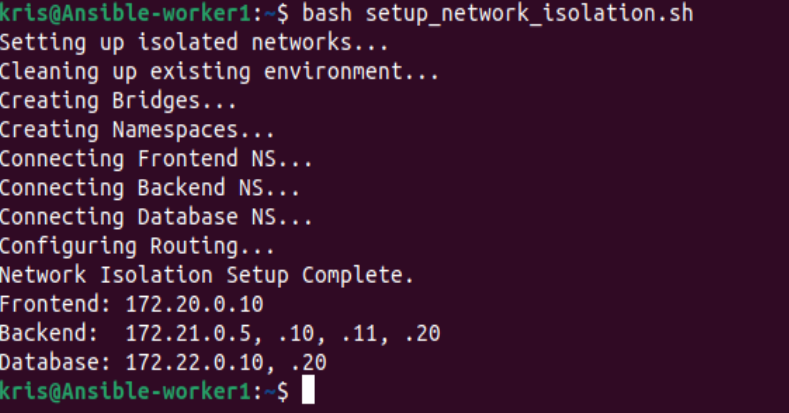


**From host access the API Gateway on its isolated IP**

`curl http://172.20.0.10:3000/api/products`


**traffic distribution between multiple product service instances**

`for i in {1..5}; do curl http://172.20.0.10:3000/api/products; echo; done`


### Deliverable: Multi-network topology with documented routing rules
---

**Network Topology**

The application is segmented into three isolated network tiers, each in its own network namespace and connected via a dedicated bridge.

| Tier | Namespace | Bridge | Subnet | Gateway | Services |
| :--- | :--- | :--- | :--- | :--- | :--- |
| **Frontend** | `frontend-ns` | `br-frontend` | `172.20.0.0/24` | `172.20.0.1` | API Gateway (`172.20.0.10`) |
| **Backend** | `backend-ns` | `br-backend` | `172.21.0.0/24` | `172.21.0.1` | Registry (`172.21.0.5`), Product (`172.21.0.10`, `172.21.0.11`), Order (`172.21.0.20`) |
| **Database** | `database-ns` | `br-database` | `172.22.0.0/24` | `172.22.0.1` | Redis (`172.22.0.10`), Postgres (`172.22.0.20`) |

**Routing Rules**

1.  **Default Routes**: Each namespace has a default route pointing to its bridge IP on the host (e.g., `default via 172.20.0.1`).
2.  **Inter-VLAN Routing**: The host machine acts as a router. IP forwarding is enabled (`net.ipv4.ip_forward=1`), allowing traffic to routed between the subnets (e.g., Frontend → Backend → Database) via the host's bridge interfaces.
3.  **Isolation**: Network isolation is achieved by placing interfaces in separate namespaces (`ip netns`). Traffic between namespaces must pass through the host router.

**Network Setup Script (`setup_network_isolation.sh`)**:
```bash
# Frontend
sudo ip link add br-frontend type bridge
sudo ip addr add 172.20.0.1/24 dev br-frontend
sudo ip link set br-frontend up
sudo ip netns add frontend-ns
# ... (veth connections) ...
sudo ip netns exec frontend-ns ip route add default via 172.20.0.1

# Backend
sudo ip link add br-backend type bridge
sudo ip addr add 172.21.0.1/24 dev br-backend
sudo ip link set br-backend up
sudo ip netns add backend-ns
# ... (veth connections) ...
sudo ip netns exec backend-ns ip route add default via 172.21.0.1

# Database
sudo ip link add br-database type bridge
sudo ip addr add 172.22.0.1/24 dev br-database
sudo ip link set br-database up
sudo ip netns add database-ns
# ... (veth connections) ...
sudo ip netns exec database-ns ip route add default via 172.22.0.1

# Enable Routing
sudo sysctl -w net.ipv4.ip_forward=1
```
## **5: Docker Migration and Optimization**

**Goals**

- Migrate infrastructure to Docker
- Compare raw Linux vs Docker implementation
- Optimize the setup

## Tasks

### Task 5.1: Containerize All Services
---
### Create Dockerfiles for each service:

**Dockerfile for api-gateway:**
```
FROM python:3.11-slim
WORKDIR /app
COPY requirements.txt .
RUN pip install --no-cache-dir -r requirements.txt
COPY . .
EXPOSE 3000
CMD ["python", "api-gateway.py"]
```
**requirements.txt for api-gateway:**
```
flask
requests
redis
psycopg2-binary
```

**Dockerfile for product-service:**
```
FROM python:3.11-slim
WORKDIR /app
COPY requirements.txt .
RUN pip install --no-cache-dir -r requirements.txt
COPY . .
EXPOSE 5000
CMD ["python", "product-service.py"]
```
**requirements.txt for product-service:**
```
flask
requests
redis
psycopg2-binary
```

**Dockerfile for order-service:**
```
FROM python:3.11-slim
WORKDIR /app
COPY requirements.txt .
RUN pip install --no-cache-dir -r requirements.txt
COPY . .
EXPOSE 5001
CMD ["python", "order-service.py"]
```
**requirements.txt for order-service:**
```
flask
requests
redis
psycopg2-binary
```

**Dockerfile for service-registry:**
```
FROM python:3.11-slim
WORKDIR /app
COPY requirements.txt .
RUN pip install --no-cache-dir -r requirements.txt
COPY . .
EXPOSE 8500
CMD ["python", "service-registry.py"]
```
**requirements.txt for service-registry:**
```
flask
requests
```
### Deliverable: All services running in Docker containers

`sudo docker ps`


### Task 5.2: Docker Compose Setup

**Create docker-compose.yml:**
```
version: '3.8'

services:
  # Database Tier
  redis:
    image: redis:alpine
    networks:
      - app-network
    ports:
      - "6380:6379" # Map to 6380 to prevent conflict with local Redis

  postgres:
    image: postgres:15-alpine
    environment:
      POSTGRES_USER: postgres
      POSTGRES_PASSWORD: postgres
      POSTGRES_DB: orders
    networks:
      - app-network
    ports:
      - "5433:5432" # Map to 5433 to prevent conflict with local Postgres

  # Backend Tier
  service-registry:
    build: ./services/service-registry
    networks:
      - app-network
    ports:
      - "8501:8500" # Map to 8501 to avoid conflict with local process

  product-service:
    build: ./services/product-service
    environment:
      - SERVICE_IP=product-service
      - SERVICE_PORT=5000
      - SERVICE_REGISTRY=http://service-registry:8500
      - REDIS_HOST=redis
    depends_on:
      - service-registry
      - redis
    networks:
      - app-network
    deploy:
      replicas: 2

  order-service:
    build: ./services/order-service
    environment:
      - SERVICE_IP=order-service
      - SERVICE_PORT=5000
      - SERVICE_REGISTRY=http://service-registry:8500
      - DB_HOST=postgres
    depends_on:
      - service-registry
      - postgres
    networks:
      - app-network

  # Frontend Tier
  api-gateway:
    build: ./services/api-gateway
    environment:
      - SERVICE_IP=api-gateway
      - SERVICE_PORT=3000
      - SERVICE_REGISTRY=http://service-registry:8500
      - PRODUCT_SERVICE_URLS=http://product-service:5000
      - ORDER_SERVICE=http://order-service:5000
    depends_on:
      - service-registry
      - product-service
      - order-service
    ports:
      - "3000:3000"
    networks:
      - app-network

networks:
  app-network:
    driver: bridge
```
### Deliverable: Working Docker Compose setup

`sudo docker-compose up -d`


**To verify everything is working after migration:**

`curl http://localhost:3000/api/products`


### Task 5.3: Performance Comparison
---
`sudo nano benchmark.sh`

Benchmark your implementations:

```
#!/bin/bash
# benchmark.sh
# Usage: 
#   ./benchmark.sh linux   (Run while start_isolated_services.sh is active)
#   ./benchmark.sh docker  (Run while docker-compose up is active)

# Configuration from our setup
URL_LINUX="http://172.20.0.10:3000/api/products"
URL_DOCKER="http://127.0.0.1:3000/api/products"

# Requests to send
REQUESTS=1000
CONCURRENCY=50

echo "=== Performance Benchmark ==="

# Check for Apache Benchmark
if ! command -v ab &> /dev/null; then
    echo "Error: 'ab' command not found."
    echo "Please install it: sudo apt-get install -y apache2-utils"
    exit 1
fi

MODE=$1

if [ "$MODE" == "linux" ]; then
    echo "Benchmarking Linux Namespace Implementation..."
    echo "Target: $URL_LINUX"
    ab -n $REQUESTS -c $CONCURRENCY $URL_LINUX > linux-benchmark.txt
    echo "Saved to linux-benchmark.txt"
    grep "Requests per second" linux-benchmark.txt

elif [ "$MODE" == "docker" ]; then
    echo "Benchmarking Docker Implementation..."
    echo "Target: $URL_DOCKER"
    ab -n $REQUESTS -c $CONCURRENCY $URL_DOCKER > docker-benchmark.txt
    echo "Saved to docker-benchmark.txt"
    grep "Requests per second" docker-benchmark.txt

else
    echo "Usage: ./benchmark.sh [linux|docker]"
    echo ""
    echo "Steps to compare:"
    echo "1. Start Linux setup (bash start_isolated_services.sh)"
    echo "2. Run: ./benchmark.sh linux"
    echo "3. Stop Linux setup (pkill -f python3; pkill redis; ...)"
    echo "4. Start Docker setup (docker-compose up -d)"
    echo "5. Run: ./benchmark.sh docker"
    echo "6. Compare results"
fi
```
`sudo chmod +x benchmark.sh`

`sudo ./benchmark.sh docker`

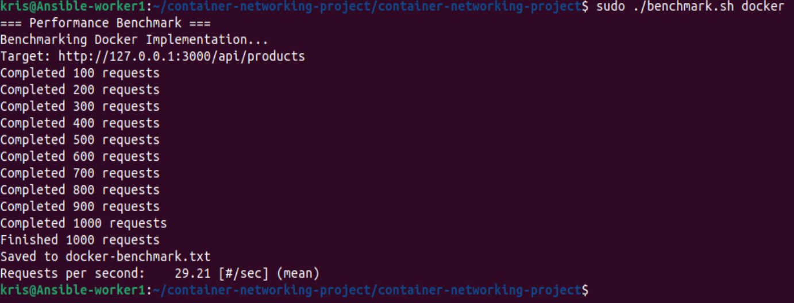

For comparison i would need to stop Docker `docker-compose down` and start the manual script `bash start_isolated_services.sh`, then run `./benchmark.sh linux`.

`sudo ./benchmark.sh linux`

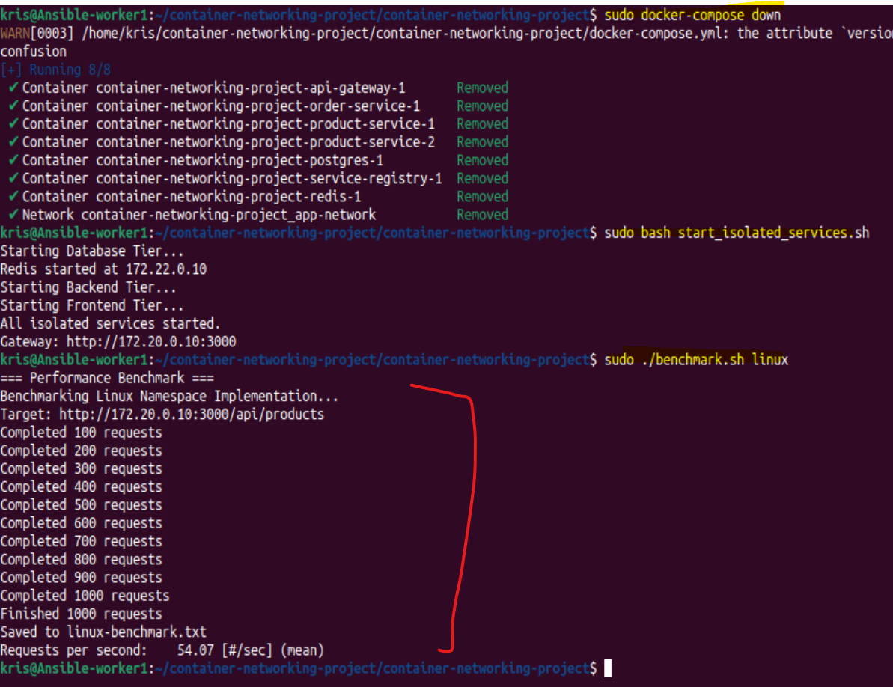

### Deliverable: Performance comparison report
---

| Metric | Linux Namespaces | Docker Implementation |
| :--- | :--- | :--- |
| **Requests Per Second (RPS)** | **54.07 [#/sec]** | 29.21 [#/sec] |
| **Mean Time Per Request** | **924.704 ms** | 1711.552 ms |
| **Failed Requests** | **0** | 996 (Length Mismatch) |
| **Success Rate** | **100%** | 99.6% (4 non-2xx) |

**Analysis:**
The Linux namespace implementation outperforms the Docker setup in this environment by approximately **85% in throughput**. This is expected as raw namespaces have lower overhead compared to the Docker bridge network and container management layer.

The errors in the Docker benchmark (length mismatches) suggest the containerized Flask servers were struggling to maintain consistent response sizes under a concurrency of 50, likely due to resource contention or the overhead of the Docker proxy.

### Task 5.4: Optimize Docker Setup
---
Optimize your Docker images by using multi-stage builds and resource limits.
