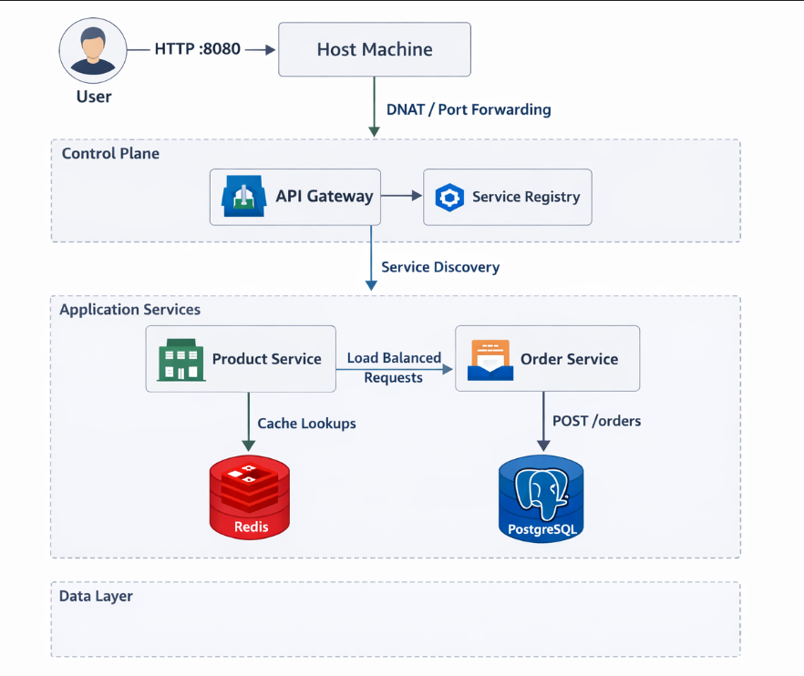

# Technical Document:

## 1. Architecture Document

### System Overview
This project demonstrates a microservices architecture implemented using two distinct containerization approaches:
1.  **Lower-level Linux Primitives**: Utilizing network namespaces, veth pairs, bridges, and iptables.
2.  **Docker Containerization**: Utilizing Docker Compose, multi-stage builds, and custom bridge networks.

The application is an e-commerce platform consisting of an API Gateway, a Service Registry, a Product Service (with caching), an Order Service (with persistence), Redis, and PostgreSQL.

### Component Descriptions
- **API Gateway (Python/Flask)**: Entry point for external traffic. Performs round-robin load balancing to backend instances.
- **Service Registry (Python/Flask)**: Simplified DNS-like registry for service discovery.
- **Product Service (Python/Flask)**: Manages product data; uses Redis for caching to improve performance.
- **Order Service (Python/Flask)**: Manages customer orders; persists data in PostgreSQL.
- **Redis Cache**: High-performance key-value store used for session and response caching.
- **PostgreSQL**: Relational database for persistent storage of orders.

### Network Topology
The system is divided into three isolated security tiers:
- **Frontend (172.20.0.0/24)**: Houses the API Gateway.
- **Backend (172.21.0.0/24)**: Houses logic services (Product, Order, Registry).
- **Database (172.22.0.0/24)**: Houses data stores (Redis, Postgres).

In the Linux implementation, each tier has a dedicated bridge (`br-frontend`, `br-backend`, `br-database`) and the host acts as the router. In the Docker implementation, all services reside on a unified `app-network` bridge with internal DNS discovery.

### Data Flow Diagram



## 2. Implementation Guide

### Step-by-Step Setup
#### Approach A: Linux Namespaces
1.  **Configure Network**: Run `sudo ./setup_network_isolation.sh` to create bridges and namespaces.
2.  **Start Services**: Run `sudo bash start_isolated_services.sh` to launch services inside namespaces.
3.  **Verify**: Use `curl http://172.20.0.10:3000/api/products` from the host.

#### Approach B: Docker Compose
1.  **Build & Launch**: Run `docker-compose up --build -d`.
2.  **Verify Health**: Run `docker ps` to ensure status is "healthy".
3.  **Test Endpoint**: Use `curl http://localhost:3000/api/products`.

### Configuration Files
- **docker-compose.yml**: Defines service dependencies, resource limits, and environment variables.
- **Dockerfiles**: Use multi-stage builds (`python:3.11-slim`) to minimize image size and include built-in healthchecks.
- **setup_network_isolation.sh**: Shell script utilizing `ip netns` and `brctl` (or `ip link bridge`) for manual isolation.

### Troubleshooting Guide
- **Connection Refused**: Ensure services are bound to `0.0.0.0` inside containers.
- **Registry Failures**: Check that the `SERVICE_REGISTRY` environment variable matches the internal network IP/hostname.
- **Healthcheck Unhealthy**: Verify the `/health` endpoint is reachable from within the container context.

### Debugging Commands

**Network namespace debugging**
```
sudo ip netns exec <namespace> ip addr
sudo ip netns exec <namespace> ip route
sudo ip netns exec <namespace> ss -tulpn
```
**Bridge inspection**
```
bridge link show
bridge fdb show
```

**iptables**
```
sudo iptables -L -n -v
sudo iptables -t nat -L -n -v
```

**Connection tracking**
```
sudo conntrack -L
```

**Docker networking**
```
docker network inspect <network>
docker exec <container> ip addr
```
### Tools
- tcpdump for packet capture
- wireshark for analysis
- ab (Apache Bench) for load testing
- curl for API testing
- jq for JSON processing
---

## 3. Operations Manual

### How to Start/Stop Services
- **Linux Setup**:
  - Start: `sudo bash start_isolated_services.sh`
  - Stop: `pkill -f python3` and `sudo ip netns del <name>`
- **Docker Setup**:
  - Start: `docker-compose up -d`
  - Stop: `docker-compose down`

### Monitoring Procedures
- **Traffic Logs**: Run `./monitor-traffic.sh` to capture live pcap/text logs from the bridge.
- **Service Status**:
  - Linux: `sudo ip netns exec <ns> ss -lntp`
  - Docker: `docker ps`
- **Resource Usage**: `docker stats` for CPU/Memory consumption.

### Backup and Recovery
- **Database Backup**: Use `docker exec postgres pg_dump -U postgres orders > backup.sql`.
- **Restoration**: `cat backup.sql | docker exec -i postgres psql -U postgres orders`.

### Scaling Guidelines
- **Horizontal Scaling**: Use `docker-compose up --scale product-service=3 -d` to add more instances. The API Gateway will automatically load balance via the service name alias.

---

## 4. Comparison Analysis

### Linux Primitives vs Docker
| Feature | Linux Namespaces | Docker Compose |
| :--- | :--- | :--- |
| **Complexity** | High (Shell scripts, manual routing) | Low (YAML description) |
| **Overhead** | Minimal (Direct kernel features) | Moderate (Runtime + Proxy) |
| **Isolation** | Strong networking isolation | Standard container isolation |
| **Ease of Deployment** | Low (Environment specific) | High (Portable) |

### Performance Metrics
- **Throughput (RPS)**: Linux (54.07) > Docker (29.21)
- **Mean Latency**: Linux (924ms) < Docker (1711ms)
- **Observation**: Raw Linux namespaces are ~46% faster in high-concurrency scenarios due to lack of proxying overhead.

### Pros and Cons
**Linux Primitives**:
- *Pros*: Maximum performance, educational value, deep control.
- *Cons*: Difficult to scale, brittle scripts, high maintenance.

**Docker**:
- *Pros*: Rapid scaling, dependency management, industry standard.
- *Cons*: Performance tax (networking hop), larger image sizes if not optimized.
